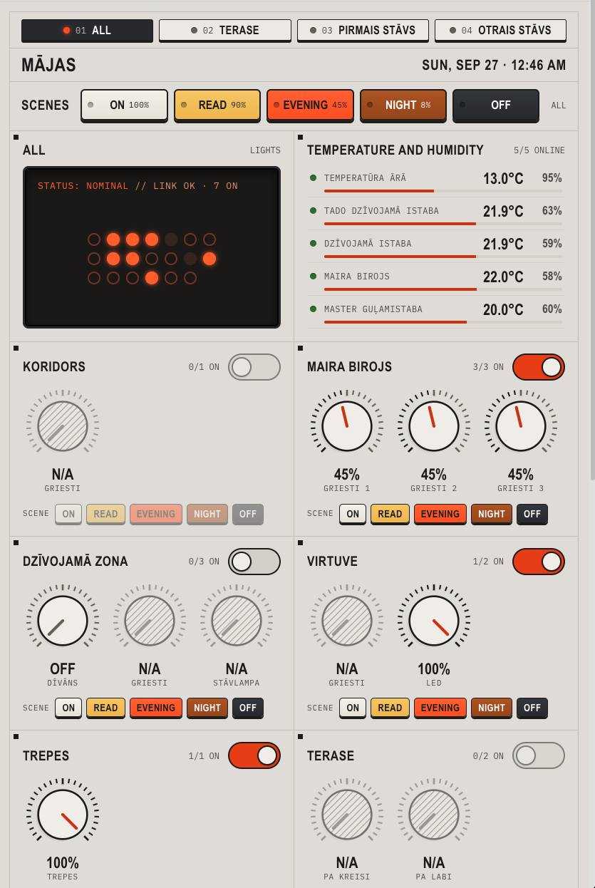

# Engineering Theme for Home Assistant

An industrial control-panel theme for Home Assistant: graphite or light-grey panels, square edges, a safety-orange accent and explicit status colours. Its typography is inspired by [teenage.engineering](https://teenage.engineering/). It has dark and light modes, both checked against WCAG 2.2 AA.



## Highlights

- **Control-panel look**: flat panels with 1px edges and 2–4px corners, no drop shadows, and a graphite neutral scale shared by menus, dialogs and switches.
- **Dark and light modes**: the theme follows the device setting, or you can choose Auto, Light or Dark per user in the profile.
- **teenage.engineering-style type, with free fonts**, self-hosted so wall tablets need no internet:
  - Hanken Grotesk for UI text (stands in for TE's Univers Next);
  - Syncopate wide caps for page, section, card and dialog titles (stands in for TE's TechnoType);
  - IBM Plex Mono for code.
- **Accessible in both modes**: 166 WCAG 2.2 AA contrast checks run before every deploy, including every code-editor syntax colour. The live UI was also scanned in a browser.
- **Orange is used deliberately**: bright orange appears only as a fill with dark text on it. Anywhere orange is text in light mode, it's the dark `#a34405`.

## Console dashboard

`www/engineering-console-card.js` is a lighting console card in the same industrial style. It's an original implementation with no dependencies, visually inspired by the [Workshop Console](https://workshop-console-demo.vercel.app/) demo (a separate commercial product; none of its code or assets are used). It provides:

- **Every light, automatically**: all `light.*` entities, grouped into one module per area, with a tab per floor (sorted by floor level). Areas are ordered by floor and then name, except for areas listed in `area_order`: those before `"..."` come first and those after it come last, each in the given order.
- **A knob per light**: drag or scroll to dim; tap, Enter or Space to toggle. There's no keyboard dimming, so screen readers announce the knob as an on/off switch with its brightness. Lights without dimming get an on/off key. Unavailable lights are hatched and disabled.
- **Grouped fixtures**: to show several bulbs as one knob, create an HA light group helper with *Hide members* and assign it to the area; hidden entities are skipped, the group appears as a single control.
- **An on/off toggle per area**, for all of that area's available lights.
- **A title from a zone**: the header shows the name of `zone` (default `zone.home`, i.e. your home location's name), or a fixed `title` if set.
- **Blinkenlights**: every 30 seconds, and on every scene change, the LCD dot matrix plays an early-computer front-panel sequence (column sweep with trail, random flicker, then each dot settles to its real state; about 3 s). It's skipped in hidden tabs and when the device prefers reduced motion.
- **CO₂ readings** in the ALL module, below the LCD: every `sensor.*` with `device_class: carbon_dioxide`, each with an LED (green < 800 ppm, amber 800–1200, red > 1200), the ppm value and a 400–2000 ppm bar. The section is hidden when no CO₂ sensor exists.
- **A Temperature and Humidity panel**, right after the ALL module, showing each sensor's temperature and the humidity from the same device (or a `humidity_map` pairing, e.g. a weather entity for outdoors). It lists listing every `sensor.*` with `device_class: temperature`. Each row has a status LED, a trimmed name, the reading and a −10…40 °C gauge bar; unavailable sensors show N/A. Clicking a row opens HA's more-info dialog.
- **An LCD summary** for the current tab: a fixed `STATUS: NOMINAL // LINK OK · n ON` line, plus one dot per light (counts are announced to screen readers), plus a **SYSTEM** fault list across all lights. With `hide_unavailable`, SYSTEM shows online counts (lights, temperature sensors) instead of listing each N/A item, and the Temperature panel lists only sensors with a reading.
- **A slim full-width Scenes strip** (ON, READ, EVENING, NIGHT, OFF) under the title bar that applies to the current tab, plus a row of **small scene keys in every area module** that apply the same scenes to just that area. Both send colour temperature only to lights that support it, and an area's keys are disabled when none of its lights are available.
- **Accessibility and theming**: knobs and toggles are ARIA switches, and every text pair passes AA in both modes (checked in the browser). It follows the theme's dark mode.

```yaml
type: custom:engineering-console-card
zone: zone.home                # optional; the zone's name is the console title
title: My console              # optional; overrides the zone name
exclude: [light.some_light]    # optional
area_order: [koridors, "...", ieeja]  # optional; before "..." = first, after = last
temperatures: true             # optional; temperature panel (default on)
temperature_exclude: [sensor.smart_kettle_temperature]  # optional
hide_unavailable: true         # optional; drop N/A rows from SYSTEM-01 and Temperature
temperature_order: [sensor.a, "..."]  # optional; like area_order, for temperature rows
co2: true                      # optional; CO2 readings under the LCD (default on)
co2_exclude: [sensor.x]        # optional
humidity: true                 # optional; humidity next to each temperature (default on)
humidity_map: {sensor.outdoor_temp: weather.home}  # optional; pair a temperature with a humidity sensor or weather entity
scenes:                        # optional; colours: cream, yellow, orange, brown, dark
  - { name: "ON", color: cream, brightness: 100, kelvin: 3500 }
  - { name: "OFF", color: dark, brightness: 0 }
```

Install it with `scripts/deploy.sh` (which copies `www/`), then `scripts/install_dashboard.sh <dashboard-url-path> dashboards/lights.json`. That registers the card as a Lovelace resource and saves a panel-view dashboard, backing up the old config first. Barlow Condensed and Share Tech Mono (OFL) are self-hosted with the other fonts.

## Palette

| Role | Dark | Light |
|---|---|---|
| Page | `#16181b` | `#e4e5e2` |
| Panels (cards) | `#1f2226` | `#f4f4f1` |
| Inputs and pickers | `#2a2e33` | `#ffffff` |
| Text | `#eceff2` (13.84:1) | `#16181b` (16.14:1) |
| Secondary text, off-state | `#a9b0b8` (7.29:1) | `#4b5157` (7.29:1) |
| Accent as text or link | `#ff7a1a` (6.12:1) | `#a34405` (5.63:1) |
| Accent fill (with `#16181b` text) | `#ff7a1a` (6.82:1) | `#df600c` (4.93:1) |
| Input outline | `#7d858e` | `#767c83` |
| Success / warning / error / info | `#3ecf6e` `#ffc53d` `#ff6b6b` `#4cc3ff` | `#1d7a3c` `#8a5a00` `#c42b2b` `#0b6aa2` |

Ratios are measured against the panel colour. Card edges (`#3a3f45` / `#c3c6c8`) are decorative, so WCAG doesn't require them to reach 3:1. Input outlines do reach it.

## Requirements

- Home Assistant **2026.9.x** (tested on Core 2026.9.3 with frontend 20260826.7).
- `frontend: themes: !include_dir_merge_named themes` in `configuration.yaml`.
- The font bridge (`www/`) for the custom fonts and title styling. Without it the theme still works, but it falls back to system fonts, and the page base font and titles stay Roboto.

## Installation

### Option A: HACS + font bridge

1. In HACS, go to **⋮ → Custom repositories**, add `https://github.com/mairisskuja/engeneering-home-assistant-theme` and choose the **Theme** type.
2. Install **Engineering Theme**. HACS only installs the theme file.
3. Copy the repository's `www/` folder to `/config/www/engineering-theme/`, then follow steps 3 and 4 of Option B.

### Option B: manual

1. Copy `themes/engineering_theme.yaml` to `/config/themes/`.
2. Copy the contents of `www/` (the file `theme-fonts.js` and the folder `fonts/`) to `/config/www/engineering-theme/`.
3. In `configuration.yaml`:
   ```yaml
   frontend:
     themes: !include_dir_merge_named themes
     extra_module_url:
       - /local/engineering-theme/theme-fonts.js
   ```
   Load only **one** font bridge. This one also covers Iconic Theme, so if you used Iconic's `iconic-fonts.js`, replace it with this one.
4. Restart Home Assistant Core. `extra_module_url` is only read at startup; later theme edits only need `frontend.reload_themes`.

### Option C: scripted over SSH

With the *Terminal & SSH* add-on running, a network port set and your key authorised:

```bash
HA_HOST=root@homeassistant.local ./scripts/deploy.sh
```

The script:
1. runs the contrast check;
2. backs up the current theme on the host;
3. copies the theme, font bridge and fonts;
4. validates the config and reloads themes;
5. confirms that Home Assistant loaded both modes.

It warns if the font bridge isn't registered, or if a second bridge is also loaded.

### Activate

Open your **Profile → Theme**, choose `engineering_theme` and pick **Auto**, **Light** or **Dark**. Then hard-refresh (Cmd+Shift+R / Ctrl+Shift+R). To set it for everyone, add this action to an automation that runs at Home Assistant start:

```yaml
action: frontend.set_theme
data:
  name: engineering_theme
```

## Fonts

teenage.engineering uses licensed Univers Next cuts and its own TechnoType, which can't be redistributed. This theme ships free lookalikes, chosen by comparing them side by side with TE's own webfonts:

| Role | TE original | Used here | Licence |
|---|---|---|---|
| UI text | Univers Next (`te-20` / `te-40`) | **Hanken Grotesk** 300–700 | SIL OFL 1.1 |
| Titles | TechnoType (wide caps) | **Syncopate** 400/700 | Apache 2.0 |
| Code | — | **IBM Plex Mono** 300–600 | SIL OFL 1.1 |

The fonts are self-hosted from `www/fonts/` and include the Latin and Latin Extended character sets, so Latvian and other European accented letters (ā, č, ē, ģ, ī, ķ, ļ, ņ, š, ū, ž) are covered. Each font's licence file is next to it.

### Where the fonts are applied

| Source | What it covers |
|---|---|
| Theme variables | Almost everything: `ha-font-family-*`, `wa-font-family-*`, `mdc-typography-font-family`, `md-ref-typeface-*`, `ha-card-header-font-family`, legacy `paper-font-*` |
| Font bridge `www/theme-fonts.js` | Loads `fonts/fonts.css`; points the places HA hardcodes Roboto at the theme fonts (page base font and sidebar, chart labels, code editor, input chips); and applies `--theme-label-font-family` to page titles, dashboard section headings and dialog titles |

The bridge doesn't hardcode any font. It follows the active theme's variables, so other themes keep their own fonts.

## Accessibility

Target: **WCAG 2.2 AA**, meaning 4.5:1 for text (1.4.3) and 3:1 for UI components such as input outlines, switch outlines and knobs, slider tracks, focus rings and state icons (1.4.11).

```bash
python3 scripts/contrast_check.py
```

It reads both mode blocks from the theme file. Where the theme doesn't override one of Home Assistant's colour tokens, it checks the colour HA actually uses for that token in each mode. It exits non-zero on any failure. See [CHANGELOG.md](CHANGELOG.md) for what was checked in the browser.

## Repository layout

```
themes/engineering_theme.yaml   The theme (dark + light)
www/theme-fonts.js              Font bridge (frontend.extra_module_url)
www/fonts/                      Self-hosted fonts, fonts.css and licences
www/engineering-console-card.js Lighting console card (custom:engineering-console-card)
dashboards/lights.json       Example dashboard config for the console
scripts/install_dashboard.sh    Registers the card and saves a dashboard config
scripts/ha_ws.py                Runs HA websocket commands on the host
scripts/contrast_check.py       WCAG gate for both modes (no dependencies)
scripts/deploy.sh               SSH deploy: check, back up, copy, reload, verify
scripts/verify_theme.py         Runs on the HA host; confirms both modes loaded
docs/HANDOVER.md                Project state, decisions and open items
CHANGELOG.md                    History, including inherited Iconic entries
NOTICE                          Upstream MIT notices
hacs.json                       HACS metadata
```

## Customising

- Put colours under `modes: dark:` **and** `modes: light:`. Top-level keys apply to both modes; use them only for fonts, geometry and the neutral grey scale.
- In light mode, keep `primary-color` dark enough to use as text. Home Assistant uses it as a text colour for tabs, links and the selected sidebar item.
- Run `scripts/contrast_check.py` after every colour change.

## Credits and licence

- Original theme and dashboard design: [Rudy Mens / LazyAdmin.nl](https://github.com/ruudmens/home-assistant-dashboard), MIT.
- Iconic Theme (accessibility rework, font bridge, tooling): [Mairis Skuja [Iconic FAB]](https://github.com/mairisskuja/iconic-home-assistant-theme), MIT.
- Engineering Theme: Mairis Skuja, built with [Claude Code](https://claude.com/claude-code).
- Fonts: Hanken Grotesk (© 2021 The Hanken Grotesk Project Authors, OFL), Syncopate (© 2010 Astigmatic, Apache 2.0), IBM Plex Mono (© 2017 IBM Corp., OFL), Barlow Condensed and Share Tech Mono (OFL).
- Console card look: visually inspired by [Workshop Console](https://workshop-console-demo.vercel.app/). The card is an independent implementation written from scratch. It uses none of Workshop Console's code or assets and isn't affiliated with or endorsed by that product.
- Visual inspiration: [teenage.engineering](https://teenage.engineering/). This project isn't affiliated with or endorsed by teenage engineering, and it doesn't include any of their fonts or assets.

This repository is released under the [GNU GPL v3.0](LICENSE). It incorporates MIT-licensed work from the projects above; their notices are kept in [NOTICE](NOTICE). The font licences are in `www/fonts/`.
